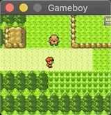

# gameboy

[](https://circleci.com/gh/ameykusurkar/gameboy)

A [Game Boy Color](https://en.wikipedia.org/wiki/Game_Boy_Color) emulator written in Rust.

_Backwards compatible with Game Boy cartidges._



### Usage

Ensure you have [Rust installed](https://www.rust-lang.org/tools/install), then run:
```shell
make sdl
```

You can then load a ROM and play by running:

```shell
cargo run --release path/to/rom/file.gb
```

If the game supports save files, the emulator will read from and write save data to the same filename as the rom, but with the extension `.sav` instead of `.gb`.

## Feature Support

### Cartridge Types
- [x] MBC1
- [x] MBC3 (with Real-Time Clock)
- [ ] MBC5

### GBC-only features
- [x] Full colour support
- [ ] H-Blank DMA Transfers
- [ ] CPU double speed mode

_The emulator has been tested with and works perfectly with Pokemon Blue and Pokemon Silver._

## Dependencies

For debugging, the emulator uses a [Rust port](https://github.com/mattbettcher/rustyPixelGameEngine) of [olcPixelGameEngine](https://github.com/OneLoneCoder/olcPixelGameEngine) for the display. License [here](https://github.com/mattbettcher/rustyPixelGameEngine/blob/master/LICENSE.md).

## Testing

I have been using [Blargg's test roms](https://github.com/retrio/gb-test-roms) to test my emulator. The emulator passes all of the `cpu_instrs` tests, and many of the other tests.

## References

This is a [curated list](https://gbdev.io/list.html) of useful resources, but the main ones I'm using are:
 - [Gameboy Pan Docs](http://bgb.bircd.org/pandocs.htm)
 - [The Ultimate Game Boy Talk](https://www.youtube.com/watch?v=HyzD8pNlpwI) (has a great explanation of how the PPU works)
 - [The Cycle-Accurate Game Boy Docs](https://github.com/AntonioND/giibiiadvance/blob/master/docs/TCAGBD.pdf)
 - [Gameboy sound hardware](https://gbdev.gg8.se/wiki/articles/Gameboy_sound_hardware)
